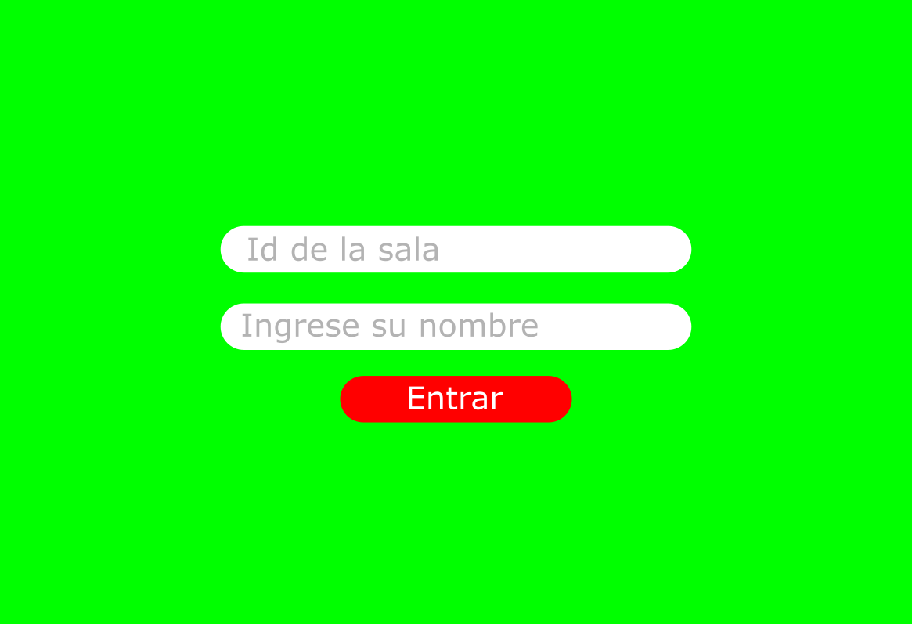
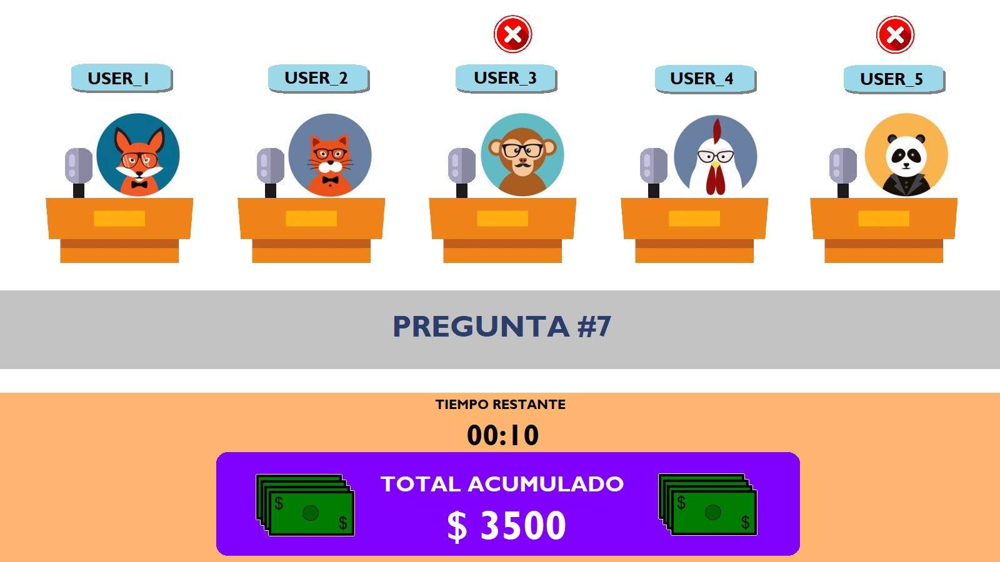

# ARSW --- ¡Responde o largate!

## Integrantes 
- Juan Carlos Alayon
- Nicolas Medina Vargas
- Brayan Andres Macias

## Resumen
¡Responde o largate! es un videojuego basado en el programa de concursos "El rival más débil", en el que varios jugadores compiten 
resolviendo questions de cultura general en un tiempo estipulado, para así recolectar dinero, el juego se divide en varias rondas
en donde en cada una, los jugadores van respondiendo y por cada respuesta correcta va sumando a un total, si un jugador falla se borra el total
acumulado, al final de una ronda, se va eliminando por votación al rival más débil, hasta que solo quede un jugador en pie.

## Pagina Web 📦

## Circle Ci 🔧

## Descripción 
Juego Basado en el programa de concursos "El rival más débil". 
### Interfaz 
_Pantalla de registro_

_Pantalla principal_

_Interfaz individual de cada jugador_

image 4
###  Modo de juego 
El juego inicia registrando a todos los participantes y mostrando los en la pantalla principal

inicia la ronda cronometrada de 15 segundos, y en cada interfaz individual va a salir una question

- Si la respuesta es correcta, se sumará una cantidad (95.000 respuesta respondida en los primeros 5 segundos, 70.000 entre 5 y 10 segundos, 50.000 más de 10 segundos) al total general
- Si la respuesta es incorrecta o no responde, se borrará el total acumulado

Al final de la ronda, los jugadores votaran por el rival más débil y este será eliminado.

_Reglas a considerar_
- Si la suma del total acumulado es mayor a 300.000, al final de cada ronda, se podrá votar por guardar el total en un banco.
- Si en una ronda se decide guardar en el banco, la próxima ronda tendrá 5 segundos de penalización 
- El dinero en el banco no se pierde por options erróneas 
- Cuando un jugador falle o no responda, saldrá su nombre en la pantalla de otros jugadores 
- Cuando solo queden dos jugadores sera ha muerte subita

### Problema que resuelve
Ofrece entretenimiento y pone a prueba tus conocimientos de cultura general, además de aprender algunos datos que no sabias

### Valor agregado
Ofrecer una version del juego a tiempo real, utilizando medios digitales, ademas de modificar y añadir reglas que creemos haran el juego mas emocionante y divertido

## Historias de usuario
https://tree.taiga.io/project/brayandres-arsw-project-2021/backlog

